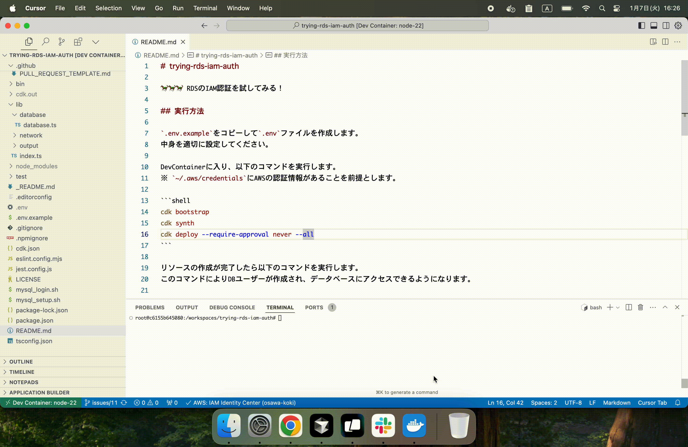

# trying-rds-iam-auth

🐎🐎🐎 RDSのIAM認証を試してみる！  

  

## 実行方法

`.env.example`をコピーして`.env`ファイルを作成します。  
中身を適切に設定してください。  

DevContainerに入り、以下のコマンドを実行します。  
※ `~/.aws/credentials`にAWSの認証情報があることを前提とします。  

```shell
cdk bootstrap
cdk synth
cdk deploy --require-approval never --all
```

リソースの作成が完了したら以下のコマンドを実行します。  
このコマンドによりDBユーザーが作成され、データベースにアクセスできるようになります。  

```shell
./mysql_setup.sh
```

MySQLにログインするためには、以下のコマンドを実行します。  

```shell
./mysql_login.sh

# SHOW DATABASES;
# SELECT DATABASE();
```

---

GitHub Actionsでデプロイするためには、以下のシークレットを設定してください。  

| シークレット名 | 説明 |
| --- | --- |
| AWS_ROLE_ARN | IAMロールARN (Ref: https://github.com/osawa-koki/oidc-integration-github-aws) |
| AWS_REGION | AWSリージョン |
| DOTENV | `.env`ファイルの内容 |

タグをプッシュすると、GitHub Actionsがデプロイを行います。  
手動でトリガーすることも可能です。  
